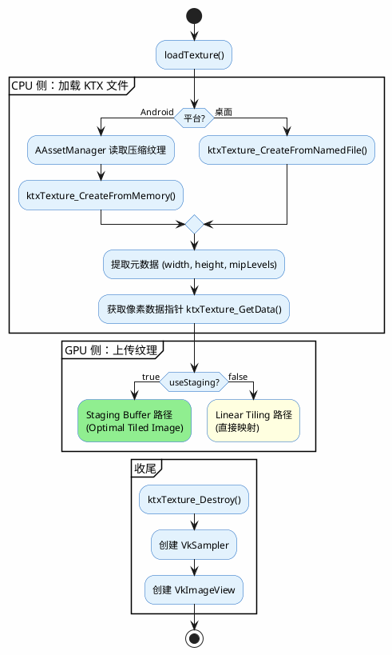
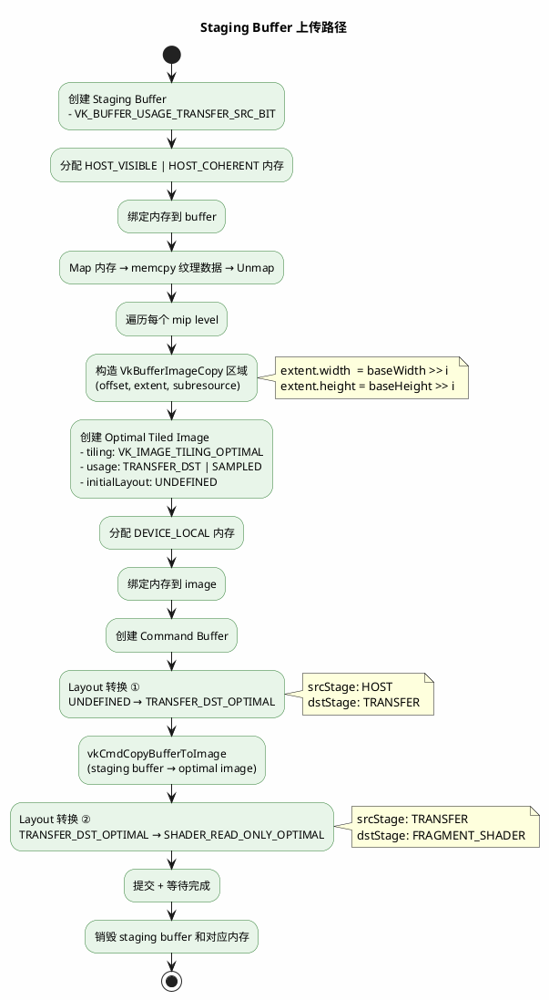
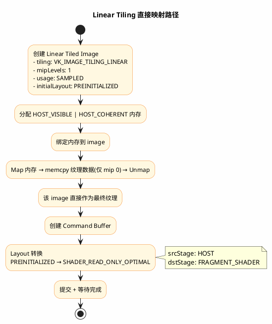

# ktxTexture_CreateFromNamedFile 流程

该函数是一条三层调用链的公开入口：

```
ktxTexture_CreateFromNamedFile
  ├── ktxTextureInt_constructFromNamedFile
  │     ├── fopen("rb") 打开文件
  │     ├── ktxFileStream_construct  将 FILE* 封装为 ktxStream
  │     └── ktxTextureInt_constructFromStream  解析 KTX 流
  └── (上层) 成功则将内部 tex 指针赋给 *newTex，失败则释放 tex 并置 NULL
```

## 各层职责

### 第 1 层：`ktxTexture_CreateFromNamedFile`（公开 API）

- 参数校验：`newTex` 不能为 NULL
- 在堆上分配一块 `ktxTextureInt` 大小的内存
- 调用第 2 层进行构造
- 成功 → 把内部指针转为公开类型写入 `*newTex`；失败 → 释放内存、`*newTex` 置 NULL
- 返回结果码

### 第 2 层：`ktxTextureInt_constructFromNamedFile`（文件打开 + 流构造）

- 参数校验：`This` 和 `filename` 不能为 NULL
- `memset` 清零整个 `ktxTextureInt` 结构体
- `fopen(filename, "rb")` 打开文件；失败返回 `KTX_FILE_OPEN_FAILED`
- `ktxFileStream_construct`：把 C 标准库 `FILE*` 封装为统一的 `ktxStream` 抽象（文件流类型），并标记为"构造者拥有该句柄"（`KTX_TRUE`），意味着后续销毁纹理会自动关闭文件
- 调用第 3 层流解析

### 第 3 层：`ktxTextureInt_constructFromStream`（KTX 格式解析核心）

这是真正干活的地方，按顺序做以下几件事：

1. **读 KTX 头部**（`KTX_HEADER_SIZE` 字节）→ `_ktxCheckHeader` 校验头部合法性，同时从中推断补充信息（纹理维度、是否压缩、是否需生成 mipmap）

2. **从头部填充纹理元数据**：
   - OpenGL 相关：`glFormat`、`glInternalformat`、`glType`、`glBaseInternalformat`
   - 尺寸：`baseWidth`、`baseHeight`、`baseDepth`（根据维数区分 1D/2D/3D）
   - 纹理属性：`numDimensions`、`numLayers`（是否数组纹理）、`numFaces`（是否立方体贴图）、`numLevels`（mipmap 级数）
   - 字节序标记：决定后续是否需要字节交换（`needSwap`）
   - `glTypeSize`：每个像素元素的字节数

3. **加载键值元数据（KV Data）**：
   - 若 `bytesOfKeyValueData > 0` 且未设置 `KTX_TEXTURE_CREATE_SKIP_KVDATA_BIT`：
     - 从流中读取全部 KV 原始数据到堆内存
     - 若需要字节交换，遍历每个键值条目交换其长度字段
     - 未设置 `KTX_TEXTURE_CREATE_RAW_KVDATA_BIT` → 反序列化为哈希表（`ktxHashList_Deserialize`）
     - 设置了该标志 → 保留原始字节供外部自行解析
   - 若设置了 `SKIP_KVDATA_BIT` → 直接在流中跳过这段数据

4. **计算图像数据大小**：通过流位置和文件总大小，减去 mip 级别数 × `sizeof(ktx_uint32_t)`（每级 faceLodSize 字段占位），得到 `dataSize`


---

# loadTexture 纹理上传流程

`loadTexture` 将 KTX 纹理文件加载并上传到 GPU，分两大阶段：CPU 侧 KTX 解析 → GPU 侧图像上传。

## 整体流程



## 分支 A：Staging Buffer 方式（`useStaging = true`，推荐路径）

将纹理数据先拷贝到 CPU 可见的 staging buffer，再通过 GPU 端拷贝到设备本地内存的 Optimal Tiled Image。



**关键点**：

- 最终纹理在 `DEVICE_LOCAL` 内存，GPU 访问性能最高
- 支持全部 mip level
- buffer→image 拷贝是 GPU 内部传输，速度快
- sampler 的 `maxLod` 设为 `mipLevels`

---

## 分支 B：Linear Tiling 直接映射方式（`useStaging = false`，仅学习用途）

纹理数据直接写入 CPU 可映射的 Linear Tiled Image，省略 staging buffer 中转。



**关键点**：

- 纹理在 `HOST_VISIBLE` 内存中，CPU 可直接读写
- 仅 1 级 mip（`mipLevels=1`），`maxLod = 0.0`
- 无需 staging buffer 和 vkCmdCopyBufferToImage，流程更短
- 但 linear tiling 对 GPU 不友好，支持范围窄、性能差，**不应用于生产**

---

## Staging Buffer vs Linear Tiling 对比

| 维度 | Staging Buffer (Optimal) | Linear Tiling |
|------|--------------------------|---------------|
| 最终内存类型 | DEVICE_LOCAL | HOST_VISIBLE |
| mipmap 支持 | 全部 mip level | 仅 level 0 |
| 拷贝次数 | 1 次 buffer→image | 0 次（直接映射写入） |
| Vulkan 对象 | stagingBuffer + image + stagingMemory + deviceMemory | image + deviceMemory |
| Layout 转换 | 2 次（UNDEFINED→TRANSFER→SHADER） | 1 次（PREINITIALIZED→SHADER） |
| GPU 性能 | 高 | 低 |
| 推荐场景 | 生产环境 | 学习/调试 |
